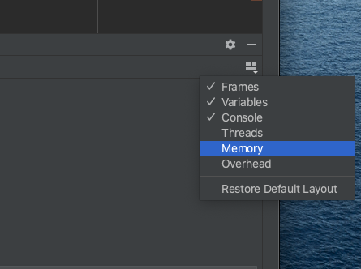
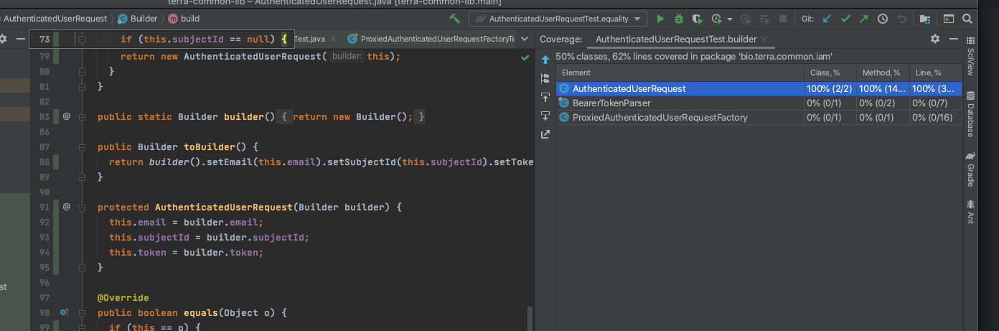

# IntelliJ for Power Users
IntelliJ has many secrets, and the easiest way to discover them is on accident. However, it's worth
compiling some of the most useful ones in one place, so that one can benefit more quickly from them.
All keyboard shortcuts are for the MacOS scheme.

## Editing
### Rectangular Edit Mode
To edit a rectangular region across multiple lines and columns,
hold down Option and drag a vertical line or rectangle. This
selection mode will allow multi-line edits without including the
beginnings and endings of the lines affected. Typing will insert a character on every line at the
cursor, and delete will kill the rectangle.

Shortcuts to advance by word work in this mode on a per-line basis, so it's possible to highlight the
third token on every line using Option+right and Option+Shift+Right. From there, changing the types of all
parameters at once is possible, as long as they're all being changed to the same thing.

A common use case is for aligning blocks of text in situations where the IDE can't choose the correct
alignment.
### Autocomplete
When typing symbols, auto-completion is available. Type tab then Enter to accept
the highlighted term, or use up and down keys to choose another one.

### Generate

Ctrl+N brings up a generate dialog, which can auto-generate
- setters: given existing private members, writes a `getMemberName()` method
- getters: same, but for `setMemberName()`
- equals and hashcode: correct versions of equals or hash code suitable for use in collections
- toString: reasonable implementation of `toString()`, using name/value pairs

Unfortunately, these items are generated only on demand, and don't get updated when new
class members are added or removed.
### Copy and Paste Special
The context menu has `Copy / Paste Special`.

#### Copy Reference
It's possible to copy fully qualified references to symbols using Cmd+Opt+Shift+C, such as
`bio.terra.stairway.fixtures.MapKey#COUNTER_START` when selecting just `COUNTER_START`.
This reference is helpful in fixing up import collisions and providing
a full package path to the Move refactoring. It's also useful for Slack
messages.
#### Paste as Plain Text
When inserting text from unknown sources that may have special characters, a plain
text insert is useful. Cmd+Opt+Shift+V, or the context menu, does this.
#### Paste from History
IntelliJ keeps track of the most recently pasted items, and makes these available
in a menu when typing Cmd+Shift+V. It includes a Paste as Plain Text option and a 
large preview pane for viewing text.

### Comment
Cmd+/ will toggle a line comment on the current line or selected section of code. This
works well when trying to decide when to delete or introduce a block of
code.

### Javadoc
Ctrl+Option+Q renders any javadoc around the cursor in place. 

Before:

After:

## Refactorings
### Introduce Refactorings
Several refactorings are available to introduce simplifications into code.

#### Introduce Constant
Cmd+Opt+C will create a class constant from a selected expression. It will suggest an UPPER_SNAKE_CASE
name which can be changed.

#### Introduce Variable
Similarly, Cmd+Opt+V creates a variable in the local scope from a selected expression.

#### Introduce Method
To introduce a method, select an expression or group of expressions with a well-defined set of inputs
and zero or one output. Not all selections are valid methods, naturally, and occasionally it's necessarily
to refactor slightly so that the tool gets the right result. Frequently, it considers values to be constant
that are desired as parameters. Those can be fixed with the Change Signature refactoring.

#### Extract Interface
A class with public methods can define an interface for those methods
and then override them with the Extract Interface refactoring. This can
be useful for declaring Spring beans that depend only on the interface,
allowing multiple implementation classes.

For best results, rename the class donating the interface to something like `MyServiceImpl`, so that
the interface can be named `MyService`.

Initial class diagram:

Final class Diagram, showing overridden interface members

IntelliJ will fix up references to the original class to refer to the new interface, if desired.

### Inline
A variable may be inlined, or replaced with its defining expression, by
Cmd+Opt+N. This practice is a good way to clean up temporary variables
that have low expressive value.

This refactoring is also available as a quick fix: note the half-highlight in the Before image.
Before:

After:

### Change Signature
The Change Signature refactoring, cmd+F6, allows renaming and rearranging parameters to a method or
constructor signature. It fixes up subclass overrides and allows previewing the result.

### Builder
The command at  `Refactor | Replace Constructor with Builder` generates
builder code for value classes. By default, it creates a stand-alone class
outside the class to be instantiated. The generated builder doesn't quite
correspond to the common practice around organization and naming. It's
generally helpful to move this generated class into the target class, rename it to `Builder`, and rename its
build method to `build()`. 

## Navigation
Some of the most common navigation commands are below. Several  more are available in the Navigate
menu.
### Back and Forward
Cmd+Opt+left/right navigate back and forth through history. This is useful especially for jumping around
withing one or two files.
### Navigate by word or token
Option+Left moves one word to the left, Opt+Right moves to the right. Left and right
with no modifiers move the cursor one character.
### Highlight
Highlighting with the keyboard is availablle by hollding down shift while navigating
by character, word, or line. It's helpful to highlight text before copying or
deleting it.
### Recent Files
Cmd+E opens the Recent Files dialog. This list can be refined by using initial letter searches of filenames.
It's especially useful when flipping to the most recently used file, since that's the file that's selected
initially. On the left side is a list of recently active tool panes for quick navigation.

### Goto Line
Cmd+G brings up an input box taking a line number to visit. A column can also be provided after a colon.

### Autowired Spring Dependencies
(IntelliJ Ultimate Only) Green spring symbols next to autowired constructor parameters or other injection
points allow navigation to the source of the bean in either a configuration or component or service. 
## Searching
There are a number of powerful, fast options for searching. Taking advantage of the different modes
is very helpful for navigating a large project.
### Text
#### Find
Cmd+F finds text in the current file. Options are available for Regex search, exact case match, and
whole words only.
#### Replace
Cmd+R does find & replace in the current file. It has the same options as Find, and can replace all
occurrences at once or visit and replace or exclude individual ones.
#### Find in Path
Ctrl+Shift+F searches textually (without regard to scope or syntax). A file type filter allows narrowing
targets by extension. 
### Targeted Search
### Structural Search and Replace
[Structural search](https://www.jetbrains.com/help/idea/structural-search-and-replace.html) allows one to specify a template combining language
keywords and wildcards and to match code to that template. This kind
of search is useful in identifying code that exhibits patterns to be changed
or inspected. It's available under Edit | Find | Search Structurally...
#### Templates
An example template to find all assignments to variables of generic types
looks like `$Type$ <$GenericArgument$>  $Var$ = $Init$;` 

There is a library of templates accessible via the Wrench menu | Existing Templates...

#### Classes
Cmd+N searches all class names. It matches on capital letters in the class name, so the class
`WsmControlledResource` would be matched by "WCR".
#### Files
Similarly, Cmd+Shift+N searches file names in the project.
#### Symbols
Cmd+Shift+Opt+N searches all symbols in the project.
#### All
Pressing shift twice in succession launches find in All categories.
### Implementations
With the cursor on a parent class, generic method, or interface, Cmd+Opt+B will
show a list of implementations suitable for navigation.
## Debugging
### Evaluate
The Evaluate window, available when in break mode, allows one to inspect state, call methods, perform
casts, or any other sanity checks. It's available with Opt+F8, and is extremely versatile and powerful.
It can be launched from anywhere, but if an expression in code is highlighted, the dialog will initially
evaluate that expression.

### Memory
The debugger Memory window can be enabled by clicking the box in the top right
corner:

When enabled, this view allows one to search for instances of a given class by
class name:

One can also track a class for new instances between break points, and filter by
tracked classes.  The image below illustrates a case where 14 instances of the
`GenericObjectPool` class entered into scope between two break points.

Note that the previous value of the Count column was 4; also note the sunglasses
icon indicating that this class type is Tracked (right clicking the class allows
for setting/clearing tracking of a class):

Double clicking on the class entry brings up a detailed view of all instances.
In this particular case, a leak of `GenericObjectPool` instance was being
investigated.  Right-clicking a given instance gives a context menu which has
the option to `Show Referring Objects...`:

This in turn brings up a window showing all of the class instances that hold
references to the object in question:

In this case, the discovery of the presence of the `MXBeanSupport`
reference led to the discovery that unexpected references were being held by
a [JMX](https://en.wikipedia.org/wiki/Java_Management_Extensions) tracking
object.  These instances accumulated across test runs where the
[`@DirtiesContext()`](https://docs.spring.io/spring-framework/docs/current/javadoc-api/org/springframework/test/annotation/DirtiesContext.html)
test annotation was used, leading to database connection exhaustion while
running tests.

## Analysis
### Diagrams
UML-style diagrams are available in IntelliJ Ultimate. Several options are available for exposing
methods, properties, inner classes, template parameters, parents, and children.

### Code Coverage
IntelliJ can provide line and class coverage for test runs.  While line/class
coverage is not the best coverage metric, this can be a helpful quick check
while developing tests.

To run a test suite or a case with coverage, right click the green arrow at the
scope of the suite/case and choose `Run '...' with Coverage`:

At the completion of the test a coverage window will appear, and source will be
annotated with green (for covered lines) and red (for uncovered lines) bars in
the left gutter:

Running with coverage again prompts as to whether to add the newly collected
coverage results to the existing results, or replace:

In this case, the add option was chosen, and the coverage has moved up to 100%
line coverage for the unit under test:

## Equipment
### Keyboard
It's very helpful to have a full-size keyboard with all of Ctrl, Cmd, and Option on both sides. Having
a missing control key on the right side is like trying to play a piano where all the C sharp keys are missing
on the right-hand side. It's just painful.

Additionally, it's very helpful to have a mechanical keyboard with a crisp stroke. This gives confidence
in keystrokes, especially with the modifier keys.
