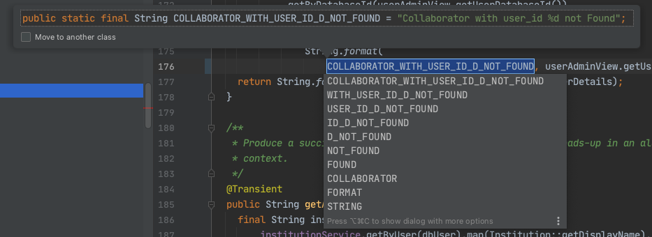

# IntelliJ for Power Users
IntelliJ has many secrets, and the easiest way to discover them is on accident. However, it's worth
compiling some of the most useful ones in one place, so that one can benefit more quickly from them.
All keyboard shortcuts are  9-5for the MacOS scheme.

## Editing
### Autocomplete
When typing symbols, auto-completion is available. Type tab then Enter to accept
the highlighted term, or use up and down keys to choose another one.

### Generate

Ctrl+N brings up a generate dialog, which can auto-generate
- setters
- getters
- equals and hashcode
- toString
- etc

Unfortunately, these items are generated only on demand, and don't get updated when new
class members are added or removed.
### Copy and Paste Special
This feature is also under the context menu as `Copy / Paste Special`.

#### Fully Qualified Reference
It's possible to copy fully qualified references to symbols using Cmd+Opt+Shift+C, such as
`bio.terra.stairway.fixtures.MapKey#COUNTER_START` when selecting just `COUNTER_START`.
#### Paste as Plain Text
When inserting text from unknown sources that may have special characters, a plain
text insert is useful. Cmd+Opt+Shift+V, or the context menu, does this.
#### Paste from History
IntelliJ keeps track of the most recently pasted items, and makes these available
in a menu when typing Cmd+Shift+V. It includes a Paste as Plain Text option and a 
large preview pane for viewing text.

### Comment
Cmd+/ will toggle a line comment on the current line or selected section of code. This
works well when trying to decide when to delete or introduce a block of
code.

### Javadoc
Ctrl+Option+Q renders any javadoc around the cursor in place. 
### Builder

## Refactorings
### Introduce Refactorings
Several refactorings are available to introduce simplifications into code.

#### Introduce Constant
Cmd+Opt+C will create a class constant from a selected expression. It will suggest an UPPER_SNAKE_CASE
name which can be changed.

#### Variable
Similarly, Cmd+Opt+V creates a variable in the local scope from a selected expression.

#### Method
To introduce a method, select an expression or group of expressions with a well-defined set of inputs
and zero or one output. Not all selections are valid methods, naturally, and occasionally it's necessarily
to refactor slightly so that the tool gets the right result. Frequently, it considers values to be constant
that are desired as parameters. Those can be fixed with the Change Signature refactoring.

#### Change Signature
The Change Signature refactoring, cmd+F6, allows renaming and rearranging parameters to a method or
constructor signature. It fixes up subclass overrides and allows previewing the result.

## Navigation
### Back and Forward
Cmd+Opt+left/right navigate back and forth through history. This isuseful especially for jumping around
withing one or two files.
### Navigate by word or token
Option+Left moves one word to the left, Opt+Right moves to the right. Left and right
with no modifiers move the cursor one character.
### Highlight
Highlighting with the keyboard is availablle by hollding down shift while navigating
by character, word, or line. It's helpful to highlight text before copying or
deleting it.
### Recent Files
Cmd+E opens the Recent Files dialog. This list can be refined by using initial letter searches of filenames.
It's especially useful when flipping to the most recently used file, since that's the file that's selected
initially. On the left side is a list of recently active tool panes for quick navigation.

### Goto Line
Cmd+G brings up an input box taking a line number to visit. A column can also be provided after a colon.
### Autowired Spring Dependencies
(IntelliJ Ultimate Only) Green spring symbols next to autowired constructor parameters or other injection
points allow navigation to the source of the bean in either a configuration or component or service. 
## Searching
There are a number of powerful, fast options for searching. Taking advantage of the different modes
is very helpful for navigating a large project.
### Text
#### Find
Cmd+F finds text in the current file. Options are available for Regex search, exact case match, and
whole words only.
#### Replace
Cmd+R does find & replace in the current file. It has the same options as Find, and can replace all
occurrences at once or visit and replace or exclude individual ones.
#### Find in Path
Ctrl+Shift+F searches textually (without regard to scope or syntax). A file type filter allows narrowing
targets by extension. 
### Targeted Search
### Structural Search and Replace
[Structural search](https://www.jetbrains.com/help/idea/structural-search-and-replace.html) allows one to specify a template combining language
keywords and wildcards and to match code to that template. This kind
of search is useful in identifying code that exhibits patterns to be changed
or inspected. It's available under Edit | Find | Search Structurally...
#### Templates
An example template to find all assignments to variables of generic types
looks like `$Type$ <$GenericArgument$>  $Var$ = $Init$;` 

There is a library of templates accessible via the Wrench menu | Existing Templates...

#### Classes
Cmd+N searches all class names. It matches on capital letters in the class name, so the class
`WsmControlledResource` would be matched by "WCR".
#### Files
Similarly, Cmd+Shift+N searches file names in the project.
#### Symbols
Cmd+Shift+Opt+N searches all symbols in the project.
#### All
Pressing shift twice in succession launches find in All categories.
### Implementations
With the cursor on a parent class, generic method, or interface, Cmd+Opt+B will
show a list of implementations suitable for navigation.
## Debugging

## Analysis
### Diagrams
UML-style diagrams are available in IntelliJ Ultimate. Several options are available for exposing
methods, properties, inner classes, template parameters, parents, and children.

### Inspections

## Plugins
### Gradle

## Database

## Equipment
### Keyboard
It's very helpful to have a full-size keyboard with all of Ctrl, Cmd, and Option on both sides. Having
a missing control key on the right side is like trying to play a piano where all the C sharp keys are missing
on the right-hand side. It's just painful.

Additionally, it's very helpful to have a mechanical keyboard with a crisp stroke. This gives confidence
in keystrokes, especially with the modifier keys.
